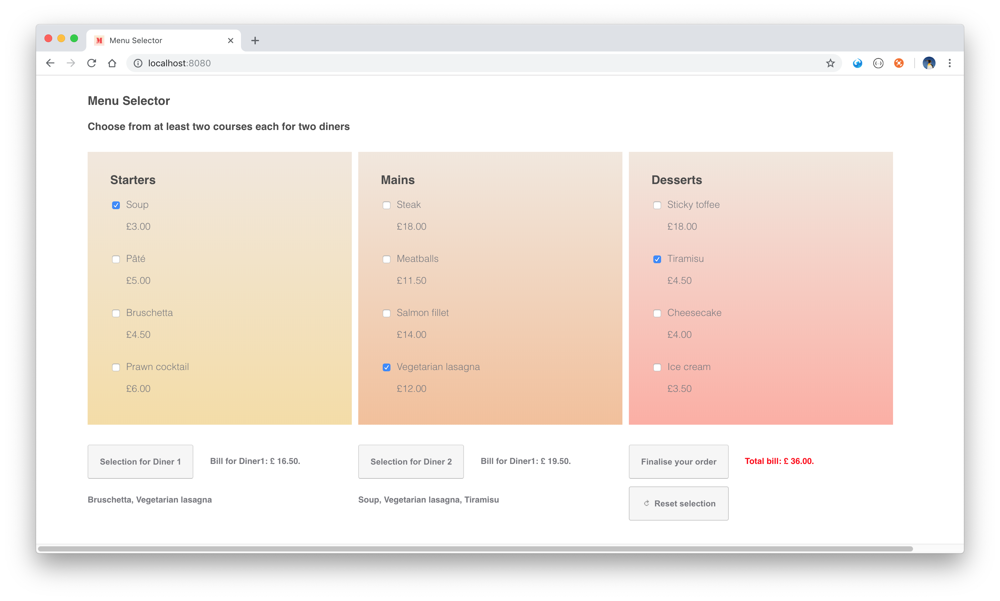

# Menu Selector

A simple menu selector, written in plain vanilla JavaScript (ES6), that allows a user to book a meal, consisting of two courses, for two diners respectively. The project can be run simply with a local server.

### Booking rules

- Each person must have at least two courses, one of which must be a main.
- Each diner cannot have more than one of the same course.
- There is only one piece of cheesecake left.
- Pierre, the snobby waiter, will not let you have prawn cocktail and salmon fillet in the same meal.
- The total bill amount is displayed when at least one dish has been selected.
- An error message is displayed when I try to select an invalid menu combination.

### Technical notes

- The folowing npm packages were used:
  - ESList: `npm install --save-dev eslint`.
  - Jest: `npm install --save-dev jest`.
- ESLint is applied and rules configured inside the `.eslintrc.js` file. Linting can be run with the command `npm run lint`.
- Unit tests for the utility helper methods are written in Jest and can be run with the command `npm run test`.
- Continous integration is incorporated into the respository by means of CircleCI.
- SCSS is used as the CSS library (at present a FileWatcher is set up via the IDE to handle the mapping to CSS; ideally this should form part of a Webpack bundling process).
- jQueryUI is used for the dialog messages.

### Future development

- Module bundling with Webpack 4 to be added (this has been implemented separately, but could not be successfully combined with Jest in time for the submission).
- Not all of the utility methods could be unit tested. There were issues with incorporating Lodash into Jest in time for the submission. Perhaps Jasmine or Karma might be more suitable testing frameworks.
- The menu data is provided by means of mockdata in a locally stored JSON file. In reality the data will be received live from a backend server. In this case the three course `
`'s in the UI need to be converted to scrollable elements.
- A suitable framework should be used for the application so that internationalisation of the messages text can be included.
- A more contemporary UI library could be considered for future development work.
- The project was tested with Google Chrome. Other browsers will need to be tested for separately.
- The UI was not built and tested on a 15" screen. It will need to be made to be more responsive for use any screensize, including for mobile platform use.

  

